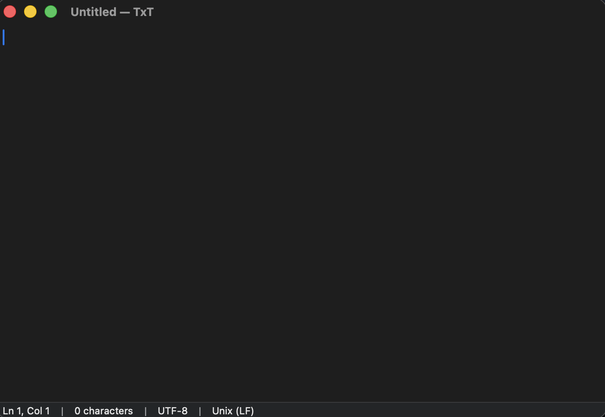

# TxT

TxT is a native macOS plain-text editor inspired by Windows 10 Notepad.



The goal of this project is to recreate the familiar Notepad workflow on macOS while keeping native AppKit/SwiftUI behavior:
- single-window document editing per file
- plain text only (`NSTextView`)
- classic file/edit/format/view flows
- find/replace, go to line, status bar, zoom, and line ending controls

## Tech Stack

- Swift 5.9+
- SwiftUI (app structure and commands)
- AppKit (`NSDocument`, `NSDocumentController`, `NSTextView`)
- Target: macOS 13 Ventura+
- No third-party dependencies

## Project Structure

`TxT/` contains the Xcode project and source files:
- `TxT.xcodeproj`
- `TxTApp.swift`
- `Document.swift`
- `ContentView.swift`
- `EditorView.swift`
- `FindReplaceBar.swift`
- `GoToLineSheet.swift`
- `StatusBarView.swift`
- `MenuCommands.swift`
- `Preferences.swift`

## Build and Run

### Requirements

- macOS 13 or newer
- Xcode 15+ recommended

### Xcode (recommended)

1. Open `TxT/TxT.xcodeproj`.
2. Select the `TxT` scheme.
3. Select destination `My Mac`.
4. Build and run with **Product > Run** (`Cmd+R`).

### Command Line (optional)

```bash
cd "TxT"
xcodebuild -project TxT.xcodeproj -scheme TxT -configuration Debug -destination "platform=macOS" build
```

## Install as a Local App

After building, find `TxT.app` in Xcode DerivedData output and copy it into `/Applications` for normal use.

If macOS warns on first launch (unsigned local build), right-click the app, choose **Open**, then confirm.

## Notes

- App data/preferences are stored with `UserDefaults`.
- Recent files are managed by `NSDocumentController`.
- This project is intended as a native desktop app prototype and learning/reference implementation.
